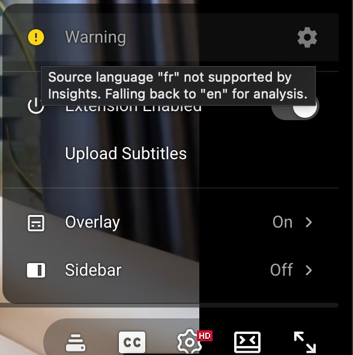

# AI Capabilities

Subtitle Insights leverages the power of [Chrome's built-in AI](https://developer.chrome.com/docs/ai/built-in) to provide a high-quality, privacy-focused learning experience.

> **Important:** The first time the extension is triggered, an internet connection is required for Chrome to download the Gemini Nano model. Once the models are downloaded, all processing happens locally on the device. For more details on how Chrome handles these downloads and updates, see the [Built-in Model Management](https://developer.chrome.com/docs/ai/understand-built-in-model-management) documentation.

## Local AI Translation

The extension uses the [Chrome Translation API](https://developer.chrome.com/docs/ai/translator-api) to generate context-aware translations for every subtitle segment.

- **Look-ahead Processing:** To ensure a smooth experience without lag, the extension pre-translates upcoming segments in the background.
- **Privacy:** Translations are generated entirely on the device. No subtitle data is sent to cloud-based translation services.

## AI Insights

Powered by **Gemini Nano** (via the [Chrome Prompt API](https://developer.chrome.com/docs/ai/prompt-api)), AI Insights provides a deep dive into the structure and meaning of complex sentences.

- **Completely Customizable:** Insights are fully personalized through [Profiles](/user-manual/profiles). Users can configure the system prompt to match their specific learning level, whether that means detailed grammatical breakdowns for beginners or high-level cultural context for advanced learners.
- **Beyond Literal Translation:** Explains idiomatic expressions and nuances that a simple translation might overlook.

::: tip Note: Language Support

  

    
  

  

The Prompt API officially supports three primary languages: **English ("en")**, **Japanese ("ja")**, and **Spanish ("es")**. While the AI can often process inputs from other languages—for example, **French ("fr") to English ("en")** is known to work—the final output must be in one of the three officially supported languages.

If a language is not supported by the Prompt API, a warning will be displayed in the extension popup to notify you that AI Insights may not be available for the current profile.

  

:::

## Buffering & Performance

Because these AI models run locally on the device's CPU/GPU, performance is hardware-dependent. A look-ahead buffering system is used to hide processing time, ensuring near-instant results during normal playback and after seeking.

- **Translation Buffer:** After a video seek, the extension immediately buffers and renders the next **10 segments**.
- **Insights Buffer:** After a video seek, it buffers the next **5 segments**.
  - **Serial Processing:** To maintain stability, the processing of each segment (sending the text to Gemini Nano) is done serially, one at a time.
  - **Session Management:** The extension monitors the **input quota** provided by the Chrome Prompt API. This quota is used to intelligently recreate AI sessions, ensuring the model remains responsive during long viewing sessions.
