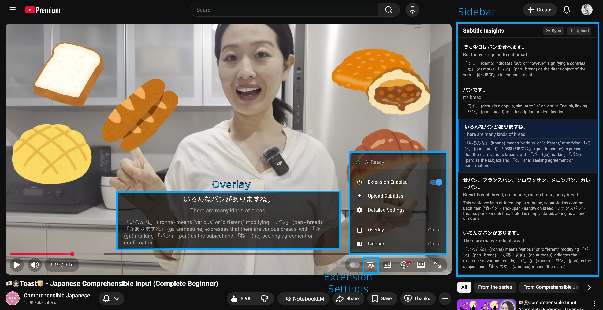

# User Interface Overview

Below is an overview of the main UI components you will interact with while using Subtitle Insights.

Source: <a href="https://www.youtube.com/watch?v=IC5RHt8unAI">Comprehensible Japanese</a>

Click on a component in the list below to learn more about how it works:

- **[Overlay](/user-manual/overlay):** The subtitle display that appears directly on top of the video player.
- **[Sidebar](/user-manual/sidebar):** The panel on the right side of the screen showing the full transcript and AI insights.
- **[Selecting Subtitles](/user-manual/selecting-subtitles):** How to choose which tracks to display and analyze.
- **[Profiles](/user-manual/profiles):** Save and switch between different configuration sets for different languages or study goals. Accessible through the `Detailed Settings` option.
- **[AI Capabilities](/user-manual/ai-capabilities):** Understand the real-time translation and grammatical analysis features.

## Extension Settings

The extension settings are accessed through the unified popup menu, which is designed to match the native YouTube and Stremio aesthetic.

### Extension Popup

The popup menu is triggered by clicking the Subtitle Insights icon in the video player's control bar. It provides quick access to high-level toggles and sub-menus for deeper customization.

#### Main Menu Toggles

- **Global Visibility:** Choose whether the Overlay or the Sidebar is active.
- **AI Toggles:** Individually enable or disable Translation and Insights.
- **Live Status:** View the current readiness of the AI models directly at the top of the menu.

### Sub-Menus

The popup features a hierarchical structure for detailed control:

#### Overlay Settings

- **Original Text Visibility:** Toggle the display of the original subtitle text.
- **Translation Visibility:** Toggle the display of the AI-generated translation.
- **Insights Visibility:** Toggle the display of the AI insights.
- **Pause on Hover:** Enable or disable the automatic pausing feature.

#### Sidebar Settings

- **Translation Visibility:** Toggle translations within the transcript view.
- **Insights Visibility:** Toggle detailed insights within the transcript view.

## Detailed Settings

At the bottom of the popup, the **Detailed Settings** link opens a full-page interface for managing [Profiles](/user-manual/profiles) and other advanced configurations.

## Keyboard Shortcuts

Subtitle Insights supports native browser shortcuts for segment navigation. These shortcuts are **not assigned by default** to avoid conflicts with your browser or site-specific keys.

### Available Commands
- **Next Segment:** Seek to the beginning of the next subtitle segment. (Preserves playback state).
- **Previous Segment:** Seek to the beginning of the previous subtitle segment. (Preserves playback state).
- **Replay Segment:** Seek to the start of the current segment and **force playback**.

### How to Configure
1. Open Chrome and navigate to `chrome://extensions/shortcuts`.
2. Find **Subtitle Insights** in the list.
3. Click the pencil icon next to each command and press your desired key combination.

> **Note:** Keyboard shortcuts are automatically disabled whenever the extension is toggled **OFF** in the settings menu.
